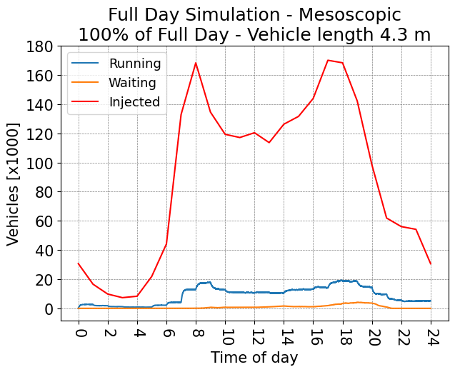

# Turin SUMO Traffic (TuST) Scenario

Contacts: Marco RAPELLI [rapelli.m@libero.it], Claudio CASETTI [claudio.casetti@polito.it] and Giandomenico GAGLIARDI [giandomenico.gagliardi@5T.torino.it]

This project is licensed under the terms of the GPLv3 license.

Please refer to the [SUMO wiki](http://sumo.dlr.de/wiki/Simulation_of_Urban_MObility_-_Wiki) for further information on the simulator itself.

**Due to the size of the considered scenario, input and output files may exceed the GitHub maximum file size limit of 100 MB.**
**For this reason it is required to use [Git LFS](https://git-lfs.github.com) to download files.**

## Overview

The _TuST (Turin SUMO Traffic)_ simulation scenario describes the traffic within the city of Turin, Italy for a whole day. The original demand data stems from real traffic data of 5T, a public agency managing all the traffic mobility data in the Italian region of Piemonte.

From the original OSM file, an accurate road graph was created using real average velocities from Google APIs and real traffic light phases from 5T data.

To validate the model, traffic flows were compared to real flows measured from 5T street sensors, crating in this way a very realistic large-scale simulator.

#### Case Study Map

#### Important Note

_TuST Scenario has been developed with_ [SUMO 1.1.0](https://github.com/eclipse/sumo/tree/v1_1_0) _and it has been successfully tested also with_ [SUMO 1.2.0](https://github.com/eclipse/sumo/tree/v1_2_0) _and_ [SUMO 1.3.1](https://github.com/eclipse/sumo/tree/v1_3_1). _Although it is possible to use it with more recent versions of SUMO, results may not correspond._
_Recommended SUMO version is_ [SUMO 1.2.0](https://github.com/eclipse/sumo/tree/v1_2_0).

## How to cite it: [BibTeX](cite.bib)

Best paper award of DS-RT 2019 to M. Rapelli, C. Casetti, G. Gagliardi,
*"TuST: from Raw Data to Vehicular Traffic Simulation in Turin"*
2019 IEEE/ACM 23rd International Symposium on Distributed Simulation and Real Time Applications (DS-RT)
October, 2019, Cosenza, Italy.

## Structure

You can find all TuST files in the _Scenario_ folder. In particular:
* **TuST.net.xml** _(62.5 MB)_ the SUMO network file.
* **TuST.poly.xml** _(15.6 MB)_ the polygon file to highlight buildings, parks and rivers in the map.
* **TAZ\_file\_residential.taz.xml** _(541.5 KB)_ the Traffic Assignment Zones file for the residential streets only.
* **TuSTVtype.xml** _(68 B)_ the vehicle type definition file.
* **Detectors.add.xml** _(12.1 MB)_ the detectors file to create the corresponding edge-based output.
* **Trip.odtrips.xml** _(357.9 MB)_ the trips file used for genereting the routes.
* **Routing.rou.xml** _(1.8 GB)_ the complete routes file used as input.
* **RoutingConfig.xml** _(1.1 KB)_ the configuration file used to rebuild routes.
* **TuST.sumocfg** _(1.5 KB)_ the configuration file for launching the simulation.

In _Scenario/Output_ folder you can find three main output files:
* **Summary.xml** _(24.4 MB)_ the simulation summary file.
* **DetectorsOutput.xml** _(311.2 MB)_ the edge-based output file from detectors.
* **VehTraces.tar.gz** _(595.2 MB zipped, 2.7 GB in total)_ the completed vehicle traces file with all routes and times for every vehicle.

## How To

TuST scenario can be lunched directly with its configuration file.
* `$SUMO_HOME/bin/sumo -c TuST.sumocfg` from the _Scenario_ folder.

In order to rebuild the routes it is possible to lunch the route configuration file.
* `$SUMO_HOME/bin/marouter -c RoutingConfig.xml` from the _Scenario_ folder.

## Statistics

The TuST scenario generate a stable simulation, as highlighted by the following plot, where waiting vehicles measurement is a congestion metric.
It is possible to see how congestion is solved after the afternoon traffic peak.

#### TuST in numbers

Description | Value 
--- | :---: 
Area | 602.61 Km2
Nodes | 32,936
Edges | 66,296
Traffic Lights | 856
Roundabouts | 501
Total edge length | 6,570.28 Km
Total lane length | 7,723.40 Km
Final departed vehicles | 2,202,814
Final waiting vehicles | 0
Final running vehicles | 5142
Final arrived vehicles | 2,197,672
Total collisions | 0
Total teleports | 334
Total halting | 19
